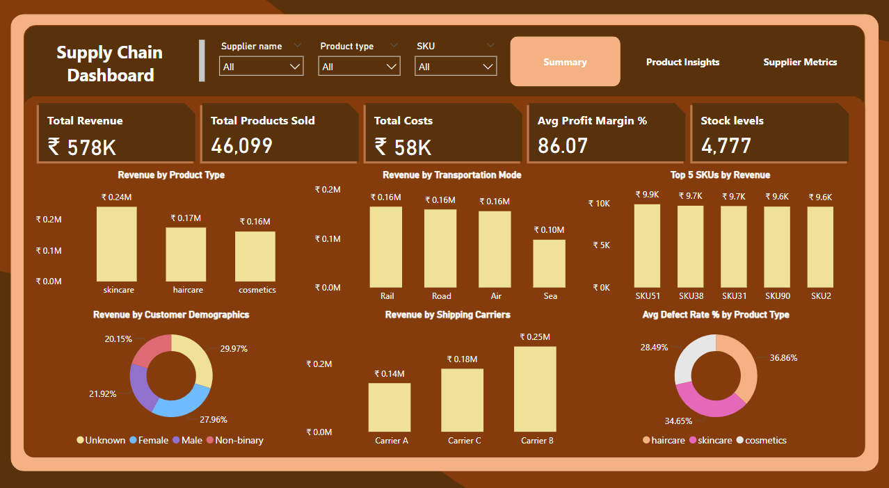
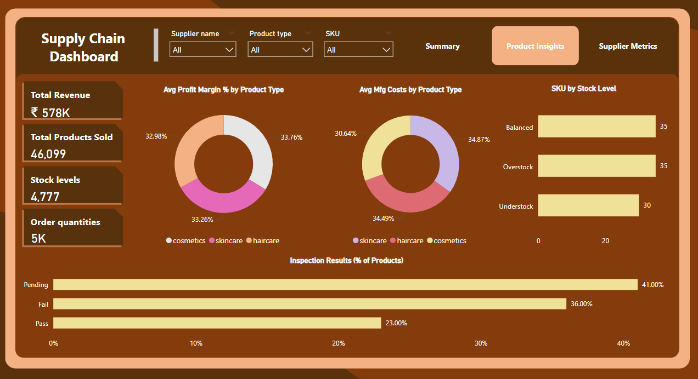
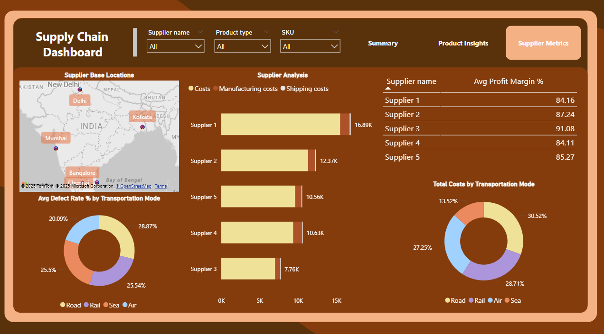

# Project -> Supply-Chain-Analysis
A business analytics case study exploring supply chain KPIs using Power BI, including profit margin, inventory turnover, and transportation efficiency.

## Table of Contents
- [Objective](#objective)
- [Business Questions](#business-questions-answered)
- [Data Cleaning](#data-cleaning--preparation)
- [Data Analysis using SQL](#data-analysis-using-sql)
- [KPIs](#key-performance-indicators-kpis)
- [Dashboards](#dashboard-overview)
- [Key Insights](#key-insights)
- [References](#references)

## Problem Statement 
A fast-growing fashion and beauty startup needed to evaluate and improve the efficiency of its supply chain operations. Key areas of focus included inventory optimization, supplier performance, quality control, and logistics efficiency.

  
**Tools used:** PowerBI • Excel • GitHub

## Objective
As a Business Analyst for a newly launched fashion and beauty startup, my objective was to evaluate the company's supply chain operations using a data-driven approach to:

- Identify inefficiencies in transportation and supplier performance
- Minimize operational and delivery costs
- Improve product quality and inspection turnaround
- Optimize inventory management across SKUs

### Business Questions Answered

1. Which product categories and customer segments drive the most revenue?
2. How efficient and cost-effective are our logistics and transportation modes?
3. What is the current state of product quality and manufacturing efficiency?
4. Which suppliers or locations are performing best in terms of cost, quality, and speed?
5. Are there inefficiencies in our inventory management and product movement?

### Data Cleaning & Preparation
- Cleaned currency formatting (₹), fixed inconsistent symbols.
- Converted data types (dates, numbers, text) correctly.
- Created key metrics:
  1. Profit, Profit Margin %, Inventory Turnover Rate
  2. Revenue per Manufacturing Day
  3. Defect Rate %, Stock/Order Quantity Ratio
- Flagged outliers (IQR method) & categorized turnover rate.
- Added stock status: Understocked, Balanced, Overstocked.
- Handled zero values, avoided divide-by-zero errors.
- Renamed columns, removed irrelevant ones, formatted as Excel Table.

### Key Performance Indicators (KPIs) 📊
| KPI                                  | Description                                      |
| ------------------------------------ | ------------------------------------------------ |
| **Total Revenue**                    | Total revenue company made                       |
| **Total Products Sold**              | Total products sold in number                    |
| **Avg Profit Margin (%)**            | Average profit margin of the company in %        |
| **Total Costs**                      | Total expenses of the company                    |
| **Stock Levels**                     | Present products in inventory by number          |

### Dashboards Overview

Three dashboards were created in Power BI:

#### Summary
- KPIs: Total Revenue, Total Products Sold, Costs, Profit Margin
- Revenue breakdown by product, transport mode, and carrier
- Top 5 SKUs by revenue
- Defect rate % by product type
- Customer demographics overview

#### Product Insights
- Profit margin & manufacturing costs by product type
- Inspection result breakdown (Pass, Fail, Pending)
- Inventory health: understocked, balanced, overstocked SKUs

#### Supplier Metrics
- Supplier location map
- Cost breakdown by supplier (Manufacturing vs Shipping)
- Revenue vs Cost per supplier
- Profit margin % per supplier
- Defect and cost rates by transport mode

### Key Insights

1. **Total Revenue:** ₹578K | **Total Costs:** ₹58K | **Total Units Sold:** 46,099  
2. **Avg Profit Margin:** 86.07% — possibly skewed by outliers  
3. **Skincare products lead** revenue contribution at 41.52%  
4. **Top 5 SKUs:** SKU51, SKU38, SKU31, SKU90, SKU2  
5. **Carrier B** contributes the highest shipping revenue  
6. **Road and Rail** are high-defect and high-cost transport modes  
7. **Haircare** has the highest average defect rate (36.86%)  
8. **70% of inventory** is either overstocked or understocked  
9. **41% of products** are pending quality inspection  
10. **Supplier 3** delivers the highest profit margin (91%) with the lowest cost  
11. **Supplier 1** generates the most revenue but also the highest cost

### Project Highlights
- Focused on actionable insights, not just visuals
- Designed dashboards with business storytelling in mind
- Built around real-world KPIs: margin, defect %, inventory health, supplier performance

